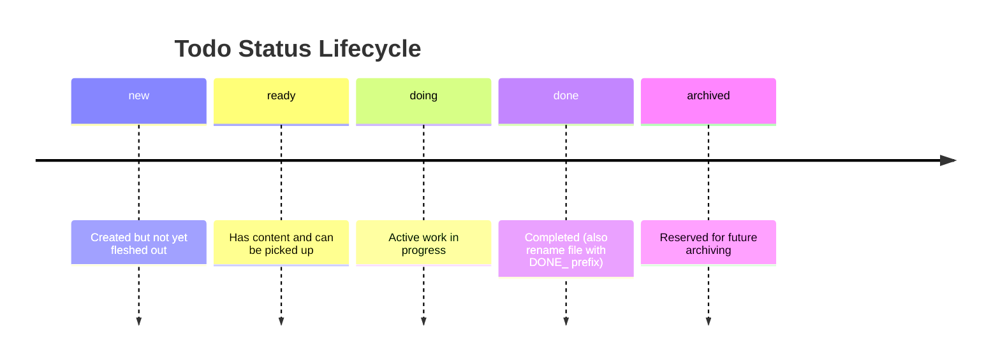

# ji-agent-skills

A collection of Claude Code plugins for AI agent workflows and skill sharing.

See the [Plugins Reference](https://code.claude.com/docs/en/plugins-reference) for general information on Claude Code plugins.

## Available Plugins

| Plugin           | Description                                   |
| ---------------- | --------------------------------------------- |
| `agent-todos`    | Agent todo file management skills             |
| `skill-teaching` | Share Claude Code skills with other AI agents |
| `hugo-blog`      | Hugo blog post management skills              |

### Agent Todos

`agent-todos` organizes AI agent work into structured todo files under `docs/agent-todos/`. It formalizes a workflow where detailed prompts and context live in Markdown files instead of ad hoc CLI messages, making tasks easier to review, share, and track across a team. The skills define folder structure, naming conventions, progress logging, and completion rules so agent work stays consistent and discoverable.

#### Skills

| Skill | Description |
| ----- | ----------- |
| `/todo-init` | Initializes the `docs/agent-todos/` folder structure with category subdirectories |
| `/todo-creation` | Creates a new todo file with sequential 4-digit numbering and YAML frontmatter |
| `/todo-processing` | Reference skill (not user-invocable) defining todo file conventions, naming, and progress tracking |
| `/todo-overview` | Generates or updates `TODO_OVERVIEW.md` with a Mermaid Kanban and a markdown table of all todos |
| `/todo-gh-issue-import` | Imports open GitHub issues into local todo files via `gh issue list` |
| `/todo-obsidian-icloud-import` | Imports todos from a local Obsidian vault synced via iCloud Drive (macOS only) |

#### Obsidian Import Setup

The `/todo-obsidian-icloud-import` skill reads from an Obsidian vault synced via iCloud Drive. To use it, create an `agent-todos/` directory inside your vault with category subdirectories matching the project structure:

```text
<YourVault>/
└── agent-todos/
    └── <project-or-category>/
        ├── 0001_some_task.md
        └── 0002_another_task.md
```

On macOS, Obsidian vaults synced through iCloud are stored at:

```text
~/Library/Mobile Documents/iCloud~md~obsidian/Documents/<vault-name>/
```

Todo files in the vault follow the same naming convention (`[NNNN]_description.md`) as local todos. The skill lists open files (excluding `DONE_` prefixed ones), lets you choose a destination category, and creates local todos via `/todo-creation`.

#### Status Lifecycle

Todo files include YAML frontmatter with a `status` field. Typical flow:



### Skill Teaching

`skill-teaching` uses the Agent Skills open standard (originally developed by Anthropic and published at [agentskills.io](https://agentskills.io/)) and copies project-scoped skills to other agents' expected directories (for example `.codex/skills`). It only operates on your project-scoped skills in `.claude/skills` and plugin skills you explicitly share via `.claude/settings.json`.

### Hugo Blog

`hugo-blog` provides skills for Hugo blog post management. `hugo-new` discovers project archetypes and content path conventions, then creates new content files via `hugo new`. `markdown-proofreading` reviews markdown files for typos, grammar, formatting consistency, and clarity.

## Installation

### Add the Marketplace

```bash
claude plugin marketplace add https://github.com/erich3000/ji-agent-skills
```

### Install the Plugins

```bash
claude plugin install agent-todos@ji-agent-skills --scope project
```

```bash
claude plugin install skill-teaching@ji-agent-skills --scope project
```

```bash
claude plugin install hugo-blog@ji-agent-skills --scope project
```
