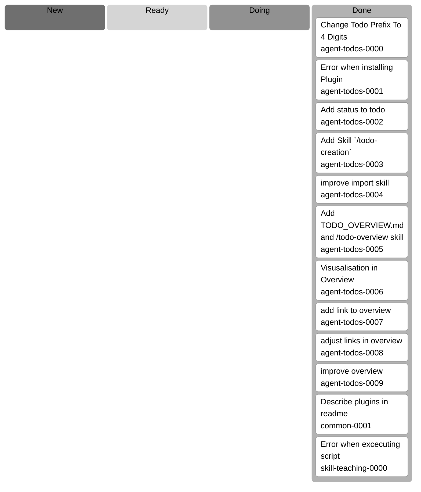

# Todo Overview

Generated on 2026-02-07 20:43:58 CET.

## Todo Kanban

## Todo List

| category | todo | status |
| --- | --- | --- |
| agent-todos | [Change Todo Prefix To 4 Digits](/docs/agent-todos/agent-todos/DONE_0000_change_todo_prefix.md) | done |
| agent-todos | [Error when installing Plugin](/docs/agent-todos/agent-todos/DONE_0001_error_when_installing.md) | done |
| agent-todos | [Add status to todo](/docs/agent-todos/agent-todos/DONE_0002_add_status_to_todo.md) | done |
| agent-todos | [Add Skill `/todo-creation`](/docs/agent-todos/agent-todos/DONE_0003_add_todo_creation-skill.md) | done |
| agent-todos | [improve import skill](/docs/agent-todos/agent-todos/DONE_0004_improve_import_skill.md) | done |
| agent-todos | [Add TODO_OVERVIEW.md and /todo-overview skill](/docs/agent-todos/agent-todos/DONE_0005_add_overview_md_and_todo_overview_skill.md) | done |
| agent-todos | [Visusalisation in Overview](/docs/agent-todos/agent-todos/DONE_0006_visusalisation_in_overview.md) | done |
| agent-todos | [add link to overview](/docs/agent-todos/agent-todos/DONE_0007_add_link_to_overview.md) | done |
| agent-todos | [adjust links in overview](/docs/agent-todos/agent-todos/DONE_0008_adjust_links_in_overview.md) | done |
| agent-todos | [improve overview](/docs/agent-todos/agent-todos/DONE_0009_improve_overview.md) | done |
| common | [Describe plugins in readme](/docs/agent-todos/common/DONE_0001-describe-plugins-in-readme.md) | done |
| skill-teaching | [Error when excecuting script](/docs/agent-todos/skill-teaching/DONE_0000_error_when_excecuting_script.md) | done |
