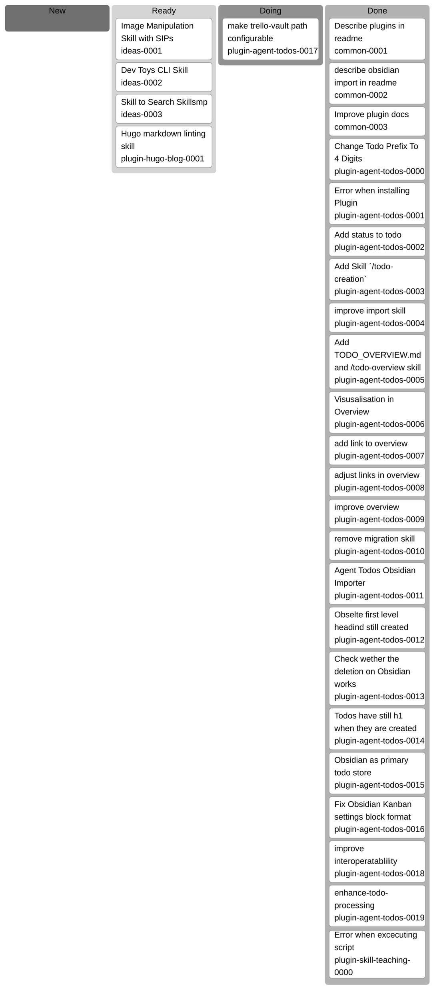

# Todo Overview

Generated on 2026-02-26 17:33:46 CET.

## Todo Kanban

## Todo List

| category | todo | status |
| --- | --- | --- |
| common | [Describe plugins in readme](/docs/agent-todos/common/DONE_0001-describe-plugins-in-readme.md) | done |
| common | [describe obsidian import in readme](/docs/agent-todos/common/DONE_0002_describe_obsidian_import_in_readme.md) | done |
| common | [Improve plugin docs](/docs/agent-todos/common/DONE_0003_improve_plugin_docs.md) | done |
| ideas | [Image Manipulation Skill with SIPs](/docs/agent-todos/ideas/0001_image_manipulation_skill_with_sips.md) | ready |
| ideas | [Dev Toys CLI Skill](/docs/agent-todos/ideas/0002_dev_toys_cli_skill.md) | ready |
| ideas | [Skill to Search Skillsmp](/docs/agent-todos/ideas/0003_skill_to_search_skillsmp.md) | ready |
| plugin-agent-todos | [make trello-vault path configurable](/docs/agent-todos/plugin-agent-todos/0017_make_trello_vault_path_configurable.md) | doing |
| plugin-agent-todos | [Change Todo Prefix To 4 Digits](/docs/agent-todos/plugin-agent-todos/DONE_0000_change_todo_prefix.md) | done |
| plugin-agent-todos | [Error when installing Plugin](/docs/agent-todos/plugin-agent-todos/DONE_0001_error_when_installing.md) | done |
| plugin-agent-todos | [Add status to todo](/docs/agent-todos/plugin-agent-todos/DONE_0002_add_status_to_todo.md) | done |
| plugin-agent-todos | [Add Skill `/todo-creation`](/docs/agent-todos/plugin-agent-todos/DONE_0003_add_todo_creation-skill.md) | done |
| plugin-agent-todos | [improve import skill](/docs/agent-todos/plugin-agent-todos/DONE_0004_improve_import_skill.md) | done |
| plugin-agent-todos | [Add TODO_OVERVIEW.md and /todo-overview skill](/docs/agent-todos/plugin-agent-todos/DONE_0005_add_overview_md_and_todo_overview_skill.md) | done |
| plugin-agent-todos | [Visusalisation in Overview](/docs/agent-todos/plugin-agent-todos/DONE_0006_visusalisation_in_overview.md) | done |
| plugin-agent-todos | [add link to overview](/docs/agent-todos/plugin-agent-todos/DONE_0007_add_link_to_overview.md) | done |
| plugin-agent-todos | [adjust links in overview](/docs/agent-todos/plugin-agent-todos/DONE_0008_adjust_links_in_overview.md) | done |
| plugin-agent-todos | [improve overview](/docs/agent-todos/plugin-agent-todos/DONE_0009_improve_overview.md) | done |
| plugin-agent-todos | [remove migration skill](/docs/agent-todos/plugin-agent-todos/DONE_0010_remove_migration_skill.md) | done |
| plugin-agent-todos | [Agent Todos Obsidian Importer](/docs/agent-todos/plugin-agent-todos/DONE_0011_agent_todos_obsidian_importer.md) | done |
| plugin-agent-todos | [Obselte first level headind still created](/docs/agent-todos/plugin-agent-todos/DONE_0012_obselte_first_level_headind_still_created.md) | done |
| plugin-agent-todos | [Check wether the deletion on Obsidian works](/docs/agent-todos/plugin-agent-todos/DONE_0013_check_wether_the_deletion_on_obsidian_works.md) | done |
| plugin-agent-todos | [Todos have still h1 when they are created](/docs/agent-todos/plugin-agent-todos/DONE_0014_todos_have_still_h1_when_they_are_created.md) | done |
| plugin-agent-todos | [Obsidian as primary todo store](/docs/agent-todos/plugin-agent-todos/DONE_0015_obsidian_as_primary_todo_store.md) | done |
| plugin-agent-todos | [Fix Obsidian Kanban settings block format](/docs/agent-todos/plugin-agent-todos/DONE_0016_fix_obsidian_kanban_settings_block_format.md) | done |
| plugin-agent-todos | [improve interoperatablility](/docs/agent-todos/plugin-agent-todos/DONE_0018_improve_interoperatablility.md) | done |
| plugin-agent-todos | [enhance-todo-processing](/docs/agent-todos/plugin-agent-todos/DONE_0019_enhance_todo_processing.md) | done |
| plugin-hugo-blog | [Hugo markdown linting skill](/docs/agent-todos/plugin-hugo-blog/0001_hugo_markdown_linting_skill.md) | ready |
| plugin-skill-teaching | [Error when excecuting script](/docs/agent-todos/plugin-skill-teaching/DONE_0000_error_when_excecuting_script.md) | done |
