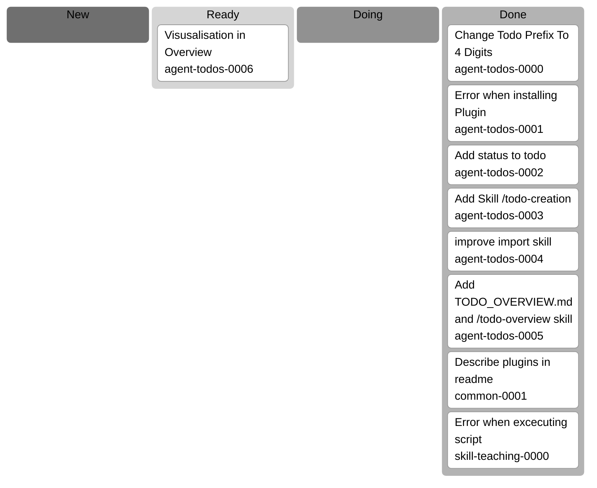

## Context

- We want to give the user a visual overview over the todos
- the idea is to use mermaid diagramm (https://mermaid.js.org/syntax/kanban.html) to visulalize which todo is in which status

## Tasks

- every Todo should have an id of they type `[CATEGORY]-[4 DIGIT PREFIX]`
- we do not want to show the archived todos
- i think we should use a script to build that stucture

### Exampla Kanban

## Progress, Decisions etc.

### 2026-02-07: Implemented script-based Kanban visualization

**What was done:**

- Updated `plugins/agent-todos/skills/todo-overview/scripts/update-overview.sh` to generate a `## Todo Kanban` Mermaid section in `docs/agent-todos/TODO_OVERVIEW.md`.
- Ensured Kanban cards are generated in the required form: `category-0000[Title]@{ ticket: category-0000 }`.
- Built ticket IDs from real todo filenames and category names, and used frontmatter `title` values for labels.
- Kept the board lanes to `new`, `ready`, `doing`, and `done`, and excluded `archived` from visualization.
- Synced the same script changes to `.codex/skills/todo-overview/scripts/update-overview.sh`.

**Decisions made:**

- Included all todos in the table output but excluded `archived` only from the Kanban board, matching the requirement to hide archived cards from the visual board.
- Reused the existing `/todo-overview` generation flow instead of creating a separate visualization script to keep one source of truth.
