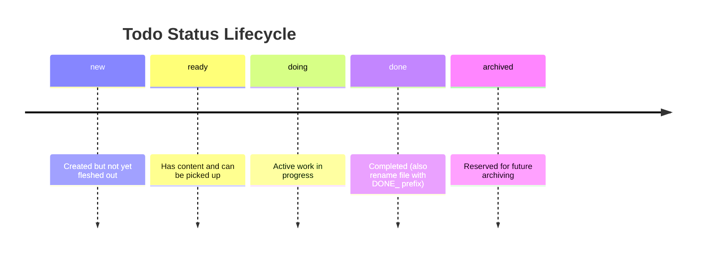

# agent-todos

`agent-todos` provides structured todo workflows for AI agents. By default, todos are stored under `docs/agent-todos/` inside the project. For workplaces where committing AI task files is not acceptable, todos can be stored in an Obsidian vault instead — configured per project via `.agent-todos.local.json`.

## What It Does

- Standardizes todo file creation, naming, and frontmatter.
- Guides agents through a status lifecycle (`new`, `ready`, `doing`, `done`, `archived`).
- Moves open todos between categories and renumbers open items without colliding with DONE items.
- Supports importing todos from GitHub issues.

## Skills

| Skill | Description |
| --- | --- |
| `/todo-init` | Initializes the todos folder structure with category subdirectories. |
| `/todo-creation` | Creates a new todo file with sequential 4-digit numbering and YAML frontmatter. |
| `/todo-processing` | Guides agents through picking up, working on, and completing todo files. |
| `/todo-moving` | Moves selected open todos between categories and renumbers open todos in both folders. |
| `/todo-gh-issue-import` | Imports open GitHub issues into local todo files using `gh issue list`. |

## Configuration

### Default (no configuration)

All skills read from and write to `docs/agent-todos/` inside the project root. No setup needed.

### Custom path (e.g. Obsidian vault)

Create `.agent-todos.local.json` in the project root (this file is gitignored by Claude Code conventions):

```json
{
  "todosRoot": "~/path/to/todos"
}
```

| Field | Required | Description |
| --- | --- | --- |
| `todosRoot` | yes | Absolute path to the todos root (holds category subdirectories). Replaces `docs/agent-todos/`. |

`~` in paths is expanded to `$HOME` at runtime.

### Switching back to default

Delete `.agent-todos.local.json`. All skills fall back to `docs/agent-todos/` immediately — no other changes needed.

## Obsidian integration

When storing todos in an Obsidian vault, the [task-notes plugin](https://tasknotes.dev/) is recommended for getting an overview of todos. It reads YAML frontmatter from your notes and provides powerful filtering and views. Todo files created by this plugin include the tags `todo` and `agent-todo` in their frontmatter, which makes them easy to filter in task-notes.

## Todo File Format

Todo files follow this structure:

```markdown
---
title: Fix soft 404 errors
status: ready
tags:
- todo
- agent-todo
---

## Problem / Context

Description of the problem.

## Tasks

- [ ] Task item 1
- [ ] Task item 2

## Progress, Decisions etc.

### YYYY-MM-DD: Progress entry

What was done.
```

## Status Lifecycle


