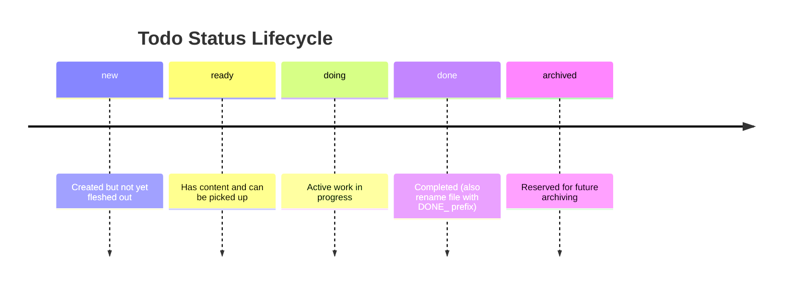

# agent-todos

`agent-todos` provides structured todo workflows for AI agents using markdown files under `docs/agent-todos/`.

## What It Does

- Standardizes todo file creation, naming, and frontmatter.
- Guides agents through a status lifecycle (`new`, `ready`, `doing`, `done`, `archived`).
- Generates project-level todo overviews and visual status boards.
- Moves open todos between categories and renumbers open items without colliding with DONE items.
- Supports importing todos from GitHub issues and Obsidian/iCloud vaults.

## Skills

| Skill                          | Description                                                                         |
| ------------------------------ | ----------------------------------------------------------------------------------- |
| `/todo-init`                   | Initializes the `docs/agent-todos/` folder structure with category subdirectories.  |
| `/todo-creation`               | Creates a new todo file with sequential 4-digit numbering and YAML frontmatter.     |
| `/todo-processing`             | Reference skill defining todo file conventions, naming, and progress tracking.      |
| `/todo-overview`               | Generates or updates `docs/agent-todos/TODO_OVERVIEW.md` with Kanban + table views. |
| `/todo-moving`                 | Moves selected open todos between categories and renumbers open todos in both folders. |
| `/todo-gh-issue-import`        | Imports open GitHub issues into local todo files using `gh issue list`.             |
| `/todo-obsidian-icloud-import` | Imports todos from a local Obsidian vault synced via iCloud Drive (macOS).          |

## Obsidian Import Setup

The `/todo-obsidian-icloud-import` skill reads from an Obsidian vault synced via iCloud Drive. Create an `agent-todos/` directory in your vault:

```text
<YourVault>/
└── agent-todos/
    └── <project-or-category>/
        ├── 0001_some_task.md
        └── 0002_another_task.md
```

On macOS, iCloud-backed Obsidian vaults are typically located at:

```text
~/Library/Mobile Documents/iCloud~md~obsidian/Documents/<vault-name>/
```

## Status Lifecycle


