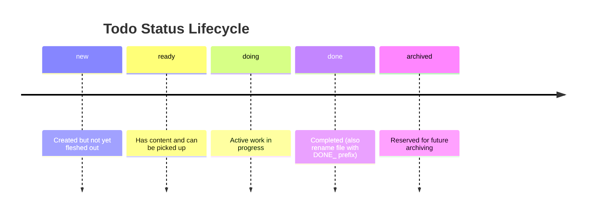

# agent-todos

`agent-todos` provides structured todo workflows for AI agents. By default, todos are stored under `docs/agent-todos/` inside the project. For workplaces where committing AI task files is not acceptable, todos can be stored in an Obsidian vault instead — configured per project via `.agent-todos.local.json`.

## What It Does

- Standardizes todo file creation, naming, and frontmatter.
- Guides agents through a status lifecycle (`new`, `ready`, `doing`, `done`, `archived`).
- Generates an Obsidian Kanban board overview when `kanbanFile` is configured.
- Moves open todos between categories and renumbers open items without colliding with DONE items.
- Supports importing todos from GitHub issues.

## Skills

| Skill | Description |
| --- | --- |
| `/todo-init` | Initializes the todos folder structure with category subdirectories. |
| `/todo-creation` | Creates a new todo file with sequential 4-digit numbering and YAML frontmatter. |
| `/todo-processing` | Guides agents through picking up, working on, and completing todo files. |
| `/todo-overview` | Regenerates the Obsidian Kanban board at the configured `kanbanFile` path. |
| `/todo-moving` | Moves selected open todos between categories and renumbers open todos in both folders. |
| `/todo-gh-issue-import` | Imports open GitHub issues into local todo files using `gh issue list`. |

## Configuration

### Default (no configuration)

All skills read from and write to `docs/agent-todos/` inside the project root. No setup needed.

### Obsidian mode

Create `.agent-todos.local.json` in the project root (this file is gitignored by Claude Code conventions):

```json
{
  "todosRoot": "~/Obsidian/<vault-name>/agent-todos/<project-name>",
  "vaultRoot": "~/Obsidian/<vault-name>",
  "kanbanFile": "~/Obsidian/<vault-name>/agent-todos/<project-name>-kanban.md"
}
```

| Field | Required | Description |
| --- | --- | --- |
| `todosRoot` | yes | Absolute path to the todos root (holds category subdirectories). Replaces `docs/agent-todos/`. |
| `vaultRoot` | no | Obsidian vault root. Used to compute wiki-link paths in the Kanban board. |
| `kanbanFile` | no | Obsidian Kanban output path. If not set, `/todo-overview` skips generation entirely. |

`~` in paths is expanded to `$HOME` at runtime.

When `kanbanFile` is set, `/todo-overview` generates an Obsidian Kanban board file at that path.

### Switching back to default

Delete `.agent-todos.local.json`. All skills fall back to `docs/agent-todos/` immediately — no other changes needed.

## Obsidian Kanban output format

When `kanbanFile` is configured, `/todo-overview` generates a board compatible with the [Obsidian Kanban plugin](https://github.com/mgmeyers/obsidian-kanban):

````markdown
---
kanban-plugin: board
---

## New
- [ ] [[agent-todos/my-project/misc/0001_some_task|Some task]]

## Ready
- [ ] [[agent-todos/my-project/misc/0002_other_task|Other task]]

## Doing

## Done
- [x] [[agent-todos/my-project/misc/DONE_0003_done_task|Done task]]

***

## Archive

%% kanban:settings
{"kanban-plugin":"board"}
%%
````

Wiki-link paths are computed as the file path relative to `vaultRoot` with the `.md` extension stripped.

## Status Lifecycle


