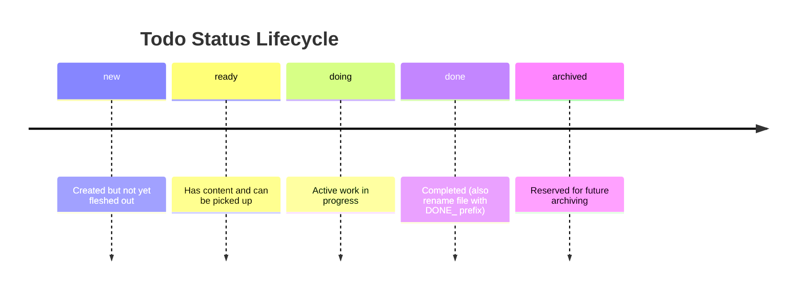

# todo-init

Initialize the `docs/agent-todos/` folder structure for AI agent task tracking.

## Workflow

1. Check if `docs/agent-todos/` already exists
   - If yes, inform the user and ask if they want to add more categories
   - If no, create the base directory

2. Ask the user which category subdirectories to create (multi-select):
   - `data/` - Data-related tasks
   - `content/` - Content creation and editing tasks
   - `misc/` - Miscellaneous tasks
   - Custom categories as needed

3. Create the selected subdirectories

4. Copy the `<base_directory>/resources/README.md` into `docs/agent-todos/` in order to explain the structure (only on initial setup)

Where `<base_directory>` is the path shown in "Base directory for this skill:" at the top of the skill invocation.

## README Template

```markdown
# Agent Todos

This folder contains task files for AI agents working on this project.

## Structure

- Each subdirectory represents a category of tasks
- Task files use the naming convention: `[NNNN]_[description].md`
- Each todo file has YAML frontmatter with `title` and `status` fields
- Completed tasks are prefixed with `DONE_`

## Status Lifecycle

Todo files include YAML frontmatter with a `status` field. Typical flow:



## Overview

For an up-to-date overview of all todos, see:

- [`/docs/agent-todos/TODO_OVERVIEW.md`](/docs/agent-todos/TODO_OVERVIEW.md)

## Related Skills

- `/todo-creation` - Create a new todo file with sequential numbering
- `/todo-gh-issue-import` - Import GitHub issues as todo files
- `/todo-overview` - Create and update the todo overview table
- `/todo-processing` - Work with and update todo files

See the skill documentation for details on file format and workflow.
```

## Notes

- This skill only creates the folder structure
- Use `/todo-creation` to create individual todo files
- Use `/todo-gh-issue-import` to populate with tasks from GitHub issues
- Use `/todo-overview` to generate or refresh `docs/agent-todos/TODO_OVERVIEW.md`
- Use `/todo-processing` to work with existing todo files
