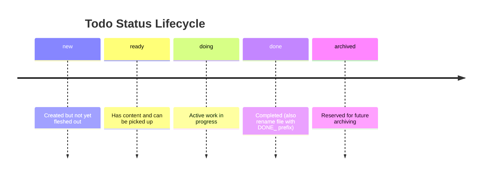

# Agent Todos

This folder is the todo store for AI agent tasks on this project.

## Structure

- Each subdirectory represents a category of tasks
- Task files use the naming convention: `[NNNN]_[description].md`
- Completed tasks are prefixed with `DONE_`

## Todo Store

The todo store location is configured in `.agent-todos.local.json` at the project root. By default it is `docs/agent-todos/` inside the project, but it can point to any folder — including a path inside an Obsidian vault.

Users with Obsidian can additionally configure a `kanbanFile` path to get an automatically updated Kanban board.

## Status Lifecycle

Todo files include YAML frontmatter with a `status` field. Typical flow:

## Related Skills

- `/todo-init` - Set up or reconfigure the todo store
- `/todo-creation` - Create a new todo file with sequential numbering
- `/todo-gh-issue-import` - Import GitHub issues as todo files
- `/todo-overview` - Regenerate the Obsidian Kanban board (requires kanbanFile config)
- `/todo-processing` - Work with and update todo files

See the skill documentation for details on file format and workflow.
